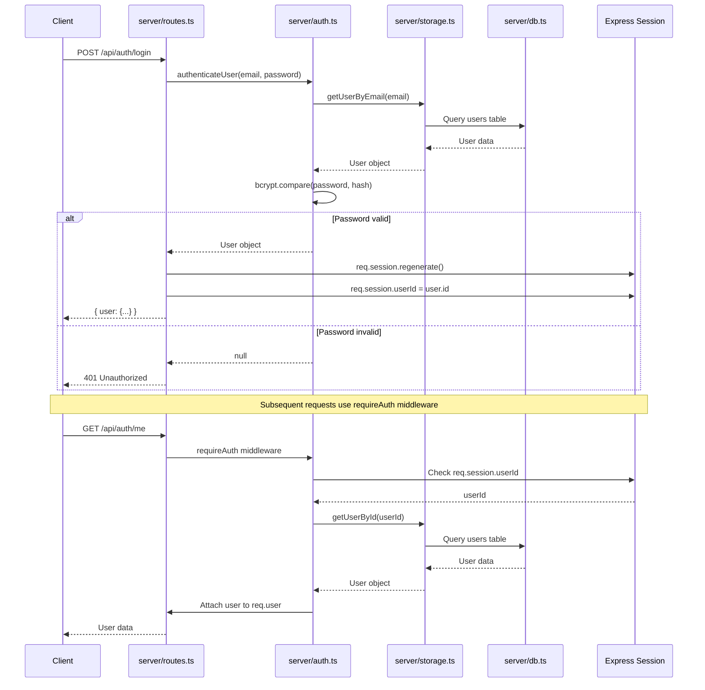
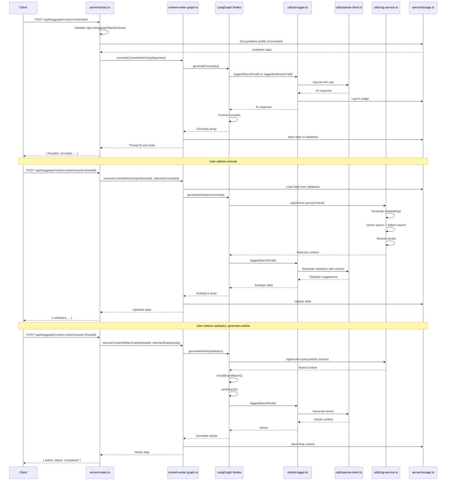
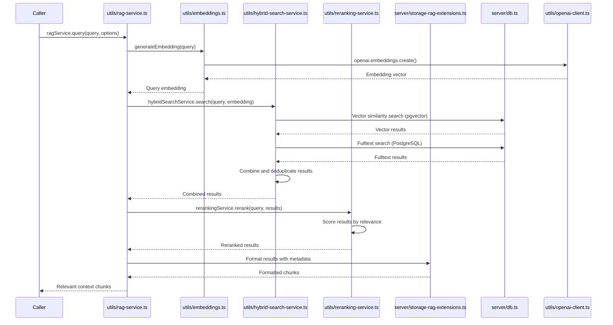
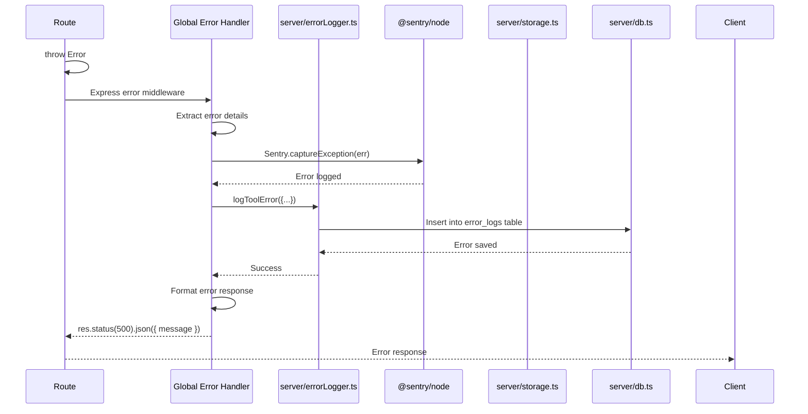
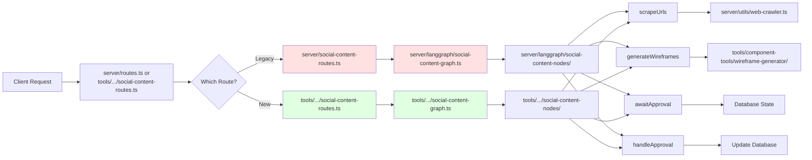
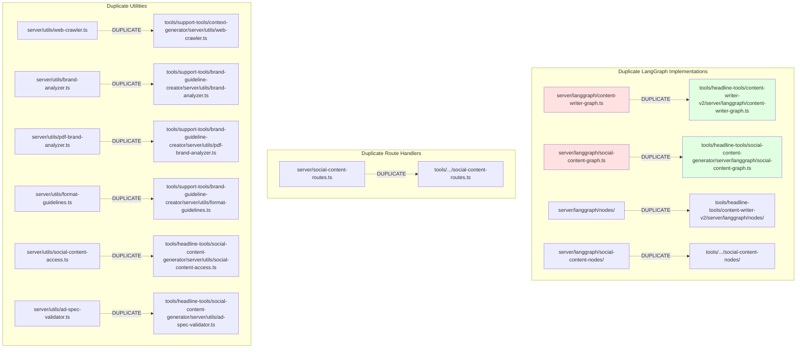

# Codebase Dependency Diagrams

## Module-Level Architecture

```mermaid
graph TB
    subgraph "Entry Points"
        ServerEntry[server/index.ts]
        ClientEntry[client/src/main.tsx]
        PythonEntry[Ad Copy Generator App/app.py]
    end

    subgraph "Server Core"
        ServerEntry --> Routes[server/routes.ts]
        ServerEntry --> Auth[server/auth.ts]
        ServerEntry --> Config[server/config.ts]
        ServerEntry --> ErrorLogger[server/errorLogger.ts]
        ServerEntry --> RateLimit[server/rate-limit.ts]
        ServerEntry --> Vite[server/vite.ts]
        
        Routes --> Storage[server/storage.ts]
        Routes --> DB[server/db.ts]
        Routes --> Email[server/email.ts]
        Routes --> CrawlHandler[server/crawl-handler.ts]
        
        Routes --> CMSRoutes[server/cms-routes.ts]
        Routes --> ObjectStorageRoutes[server/object-storage-routes.ts]
        Routes --> SocialContentRoutes[server/social-content-routes.ts]
    end

    subgraph "LangGraph Workflows"
        Routes --> LegacyContentGraph[server/langgraph/content-writer-graph.ts]
        Routes --> LegacySocialGraph[server/langgraph/social-content-graph.ts]
        Routes --> NewContentGraph[tools/headline-tools/content-writer-v2/server/langgraph/content-writer-graph.ts]
        Routes --> NewSocialGraph[tools/headline-tools/social-content-generator/server/langgraph/social-content-graph.ts]
        Routes --> QCGraph[tools/support-tools/quality-control/server/langgraph/qc/qc-subgraph.ts]
        
        LegacyContentGraph --> LegacyNodes[server/langgraph/nodes/]
        NewContentGraph --> NewNodes[tools/headline-tools/content-writer-v2/server/langgraph/nodes/]
        LegacySocialGraph --> LegacySocialNodes[server/langgraph/social-content-nodes/]
        NewSocialGraph --> NewSocialNodes[tools/headline-tools/social-content-generator/server/langgraph/social-content-nodes/]
        QCGraph --> QCNodes[tools/support-tools/quality-control/server/langgraph/qc/nodes/]
    end

    subgraph "Server Utilities"
        Routes --> RAGService[server/utils/rag-service.ts]
        Routes --> BrandAnalyzer[server/utils/brand-analyzer.ts]
        Routes --> FormatGuidelines[server/utils/format-guidelines.ts]
        Routes --> LanguageHelpers[server/utils/language-helpers.ts]
        Routes --> AILogger[server/utils/ai-logger.ts]
        Routes --> Sanitize[server/utils/sanitize.ts]
        
        RAGService --> Embeddings[server/utils/embeddings.ts]
        RAGService --> Chunking[server/utils/chunking.ts]
        RAGService --> HybridSearch[server/utils/hybrid-search-service.ts]
        RAGService --> Reranking[server/utils/reranking-service.ts]
        RAGService --> WebCrawler[server/utils/web-crawler.ts]
        
        BrandAnalyzer --> PDFAnalyzer[server/utils/pdf-brand-analyzer.ts]
        WebCrawler --> HTMLToMarkdown[server/utils/html-to-markdown.ts]
        
        AILogger --> OpenAIClient[server/utils/openai-client.ts]
        AILogger --> APIRetry[server/utils/api-retry.ts]
    end

    subgraph "Tool Routes"
        Routes --> SEORoutes[tools/headline-tools/seo-meta-generator/server/routes.ts]
        Routes --> GoogleAdsRoutes[tools/headline-tools/google-ads-copy-generator/server/routes.ts]
        Routes --> ContentWriterRoutes[tools/headline-tools/content-writer-v2/server/routes.ts]
        Routes --> SocialContentRoutesNew[tools/headline-tools/social-content-generator/server/social-content-routes.ts]
    end

    subgraph "Component Tools"
        LegacyNodes --> ArticleGen[tools/component-tools/article-generator/server/generateArticle.ts]
        LegacyNodes --> BrandGuardian[tools/component-tools/brand-guardian/server/brand-guardian.ts]
        LegacyNodes --> ConceptGen[tools/component-tools/concept-generator/server/generateConcepts.ts]
        LegacyNodes --> FactChecker[tools/component-tools/fact-checker/server/fact-checker.ts]
        LegacyNodes --> Proofreader[tools/component-tools/proofreader/server/proofreader.ts]
        LegacyNodes --> Regulatory[tools/component-tools/regulatory-guardian/server/regulatory.ts]
        LegacyNodes --> SubtopicGen[tools/component-tools/subtopic-generator/server/generateSubtopics.ts]
        LegacyNodes --> URLScraper[tools/component-tools/url-scraper/server/scrapeUrls.ts]
        LegacyNodes --> WireframeGen[tools/component-tools/wireframe-generator/server/generateWireframes.ts]
        
        NewNodes --> ArticleGen
        NewNodes --> BrandGuardian
        NewNodes --> ConceptGen
        NewNodes --> FactChecker
        NewNodes --> Proofreader
        NewNodes --> Regulatory
        NewNodes --> SubtopicGen
    end

    subgraph "Support Tools"
        Routes --> BrandGuidelineCreator[tools/support-tools/brand-guideline-creator/server/utils/]
        Routes --> ContextGenerator[tools/support-tools/context-generator/server/]
        
        BrandGuidelineCreator --> BrandAnalyzer
        ContextGenerator --> WebCrawler
    end

    subgraph "Shared"
        Storage --> SharedSchema[shared/schema.ts]
        DB --> SharedSchema
        Routes --> SharedSchema
        LegacyContentGraph --> SharedSchema
        NewContentGraph --> SharedSchema
    end

    subgraph "Client Architecture"
        ClientEntry --> App[client/src/App.tsx]
        App --> Pages[client/src/pages/]
        App --> Components[client/src/components/]
        App --> Contexts[client/src/contexts/BrandContext.tsx]
        
        Pages --> Components
        Components --> UIComponents[client/src/components/ui/]
    end

    subgraph "Python App"
        PythonEntry --> APIRoutes[Ad Copy Generator App/api/routes.py]
        PythonEntry --> Services[Ad Copy Generator App/services/]
        PythonEntry --> Utils[Ad Copy Generator App/utils/]
        
        Services --> OpenAIService[Ad Copy Generator App/services/openai_service.py]
        Services --> CacheService[Ad Copy Generator App/services/cache_service.py]
        Services --> Monitoring[Ad Copy Generator App/services/monitoring.py]
        Services --> CeleryApp[Ad Copy Generator App/services/celery_app.py]
        Services --> Tasks[Ad Copy Generator App/services/tasks.py]
    end

    style ServerEntry fill:#e1f5ff
    style ClientEntry fill:#e1f5ff
    style PythonEntry fill:#e1f5ff
    style SharedSchema fill:#fff4e1
    style LegacyContentGraph fill:#ffe1e1
    style NewContentGraph fill:#e1ffe1
```



## Authentication Flow (Function-Level)



## Content Generation Flow (Function-Level)



## RAG Service Flow (Function-Level)



## Error Handling Flow (Function-Level)



## Social Content Generation Flow



## Redundancy Detection Map



## External Dependencies

```mermaid
graph LR
    subgraph "NPM Packages"
        Express[express]
        Drizzle[drizzle-orm]
        Zod[zod]
        LangChain[@langchain/*]
        OpenAI[openai]
        Anthropic[@anthropic-ai/sdk]
        Sentry[@sentry/node]
        React[react]
        Vite[vite]
    end

    subgraph "Python Packages"
        Flask[flask]
        Requests[requests]
        Pandas[pandas]
        BeautifulSoup[bs4]
        LangDetect[langdetect]
        Celery[celery]
    end

    Server[Server Code] --> Express
    Server --> Drizzle
    Server --> Zod
    Server --> LangChain
    Server --> OpenAI
    Server --> Anthropic
    Server --> Sentry
    
    Client[Client Code] --> React
    Client --> Vite
    
    Python[Python App] --> Flask
    Python --> Requests
    Python --> Pandas
    Python --> BeautifulSoup
    Python --> LangDetect
    Python --> Celery
```

